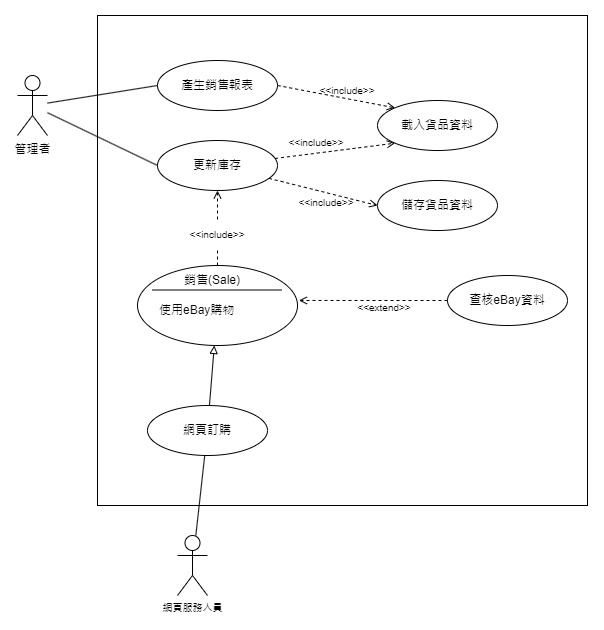

# 專題



```
一個銷售點(Point-of-Sale)管理系統的需求分析述如下:
(1) 管理者可以藉由載入(Load)貨品清單(Inventory)資料來產生報表(Inventory Reports)。
(2) 管理者可以藉由載入以及儲存貨品資料。
(3) 網頁服務人員是銷售人員(Sales Clerk)的一種。他們負責處理網頁購物。
(4) 任何銷售必須更新存貨。
(5) 假如顧客使用eBay平台，銷售人員必須查核(Verify)eBay資料。
```
